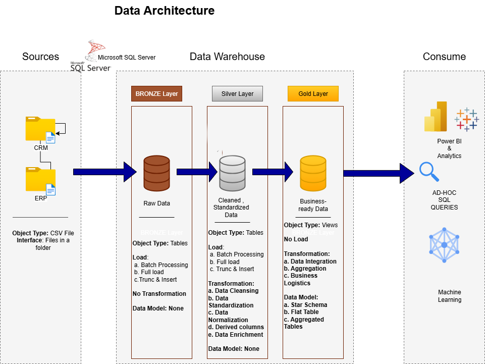

# 📊 Customer & Sales Data Warehouse Project


Welcome to the **Customer & Sales Data Warehouse Project** repository! 🚀

This project demonstrates the design and implementation of a modern Data Warehouse using SQL Server for a bike retail business selling bikes, parts, clothing, and accessories.

It covers the complete lifecycle of data engineering — from ETL (Extract, Transform, Load) pipelines, layered architecture (Bronze → Silver → Gold), and data modeling (star schema) to business-ready analytics.

The goal is to showcase end-to-end skills in data integration, warehousing, and reporting, enabling insights such as product performance, customer behavior, seasonal sales trends, and regional revenue distribution to support data-driven decision-making.
---

## 📖Project Overview

The workflow follows these major steps -:
1. **Data Architecture** 🏗️  
   - Designed a **three-layer Medallion model** (Bronze, Silver, Gold) for scalability and clarity.  
   - Documented warehouse design with **ER diagrams & architecture flowcharts**.  
    
2. **ETL Pipelines** ⚙️  
   - Built **Stored Procedures** for automated ETL from CRM & ERP systems.  
   - Performed **data quality checks** (null handling, duplicates, referential integrity).  
   - Integrated multiple data sources into a single warehouse.  

3. **Data Modeling** 📊  
   - Developed a **star schema** with `fact_sales`, `dim_customers`, `dim_products`, `dim_location`, and `dim_date`.  
   - Created **business-friendly views** in the Gold layer.  

4. **Analytics & Reporting** 📈  
   - Delivered insights on:  
     - 🛒 **Customer Behavior** → repeat buyers, customer segmentation  
     - 🚲 **Product Performance** → top-selling categories (bikes, clothing, accessories)  
     - 📆 **Sales Trends** → seasonal demand & regional distribution


---

## 🔑 Key Features

✔️ Bronze–Silver–Gold architecture (industry standard)  
✔️ Automated ETL using Stored Procedures (truncate + insert strategy)  
✔️ Star Schema Design with fact & dimension tables  
✔️ Data Quality Checks at Silver & Gold stages  
✔️ Business-ready Views for Power BI/Tableau dashboards  
✔️ End-to-End Flow: ETL → Modeling → Analytics  
✔️ Industry-specific insights for Bike Retail (bikes, parts, clothing, accessories)


----


## 📝Project Requirements

### Building The Data Warehouse

### Objective
Develop a modern Data Warehouse using SQL server to unify sales data, providing a foundation for analytics and data-driven decision-making.

### Specification
- **Data Sources**: CSV Files ( CRM & ERP)
- **Data Quality**: Clean & resolve data quality issues prior to analytics
- **Integration**: Combine the data sources into a single, user-friendly data model for analytics
- **Scope**: No historization. Only focus on latest dataset
- **Documentation**: Provide a clear documentation for data model to support business stakeholders and analytics team

### BI & Analytics ( Data Analysis)

### Objective
SQL based analytics to deliver detailed insights.
- **Customer Behaviour**
- **Product Performance**
- **Sales Trend**

---

## ⚙️ Process Breakdown

### 1. Database & Schema Setup
- Created new database `DataWarehouse`  
- Defined schemas: `bronze`, `silver`, `gold`

### 2. Bronze Layer (Raw Data Ingestion)
- Created DDL scripts for raw source tables  
- Stored Procedure loads data with truncate & insert (full load)  
- **Purpose:** Maintain raw, unmodified copies of data

### 3. Silver Layer (Data Cleaning & Transformation)
- Normalized tables designed in `silver` schema  
- Stored Procedure:
  - Truncates tables  
  - Inserts cleaned, standardized data from Bronze  
- Added **data quality checks**: duplicates, nulls, consistency

### 4. Gold Layer (Analytics-Ready Star Schema)
- Created Fact & Dimension Views:
  - `gold.dim_customers`  
  - `gold.dim_products`  
  - `gold.fact_sales`  
- Views join and enrich Silver tables → **denormalized, business-ready data**

### 5. Data Quality & Validation
- Test scripts ensure:
  - Referential integrity  
  - Consistent keys across fact/dim tables  
  - Valid ranges (e.g., no negative sales)

### 6. Reporting & Analytics
- Gold Views support dashboards (Power BI/Tableau)  
- Example KPIs:
  - 📈 Revenue by Country & Product   
  - 💰 Top Customers by Lifetime Value  
  - 🏆 Best-Performing Products

---


## 🛠️ Tech Stack
- **Database**: Microsoft SQL Server, SQL Server Express  
- **ETL**: SQL, Stored Procedures, Python (optional automation)  
- **Data Modeling**: Star Schema
- **Version Control**: Git & GitHub
- **Designing**: Draw.io

---

## 📂 Repository Structure  

```  

├── /datasets                 # Source data required  
│   ├── /source_crm  
│   │   ├── cust_info  
│   │   ├── prd_info  
│   │   └── sales_details  
│   └── /source_erp  
│       ├── cust_az12  
│       ├── loc_a101  
│       └── px_cat_g1v2  

├── /documents                # Data architecture & model diagrams, naming conventions  

├── /scripts                  # SQL scripts for ETL & DDL  
│   ├── /bronze                # Bronze layer DDL & loading scripts  
│   ├── /silver                # Silver layer transformation/loading scripts  
│   ├── /gold                  # Gold layer views & loading scripts  
│   └── init_database.sql      # Database & schema creation script  

├── /test                     # Data integrity & quality check scripts  
│   ├── quality_check.gold.sql  
│   └── quality_check.silver.sql

├── /eda                     # Exploratory data analysis scripts  
│    ├── /basic eda
       
│    ├──reports

└── README.md                 # Project overview  

```   


---

## 📊 EDA & Business Insights

The dataset represents a **Bike Retail business**. Key insights include:

### Product Categories and Subcategories
- Bikes, parts, clothing, and accessories  
- Segmented by revenue: high-performing, mid-range, low-performing

### Customer Segments
- Segmentation: VIP, Regular, New

### Geographic Spread
- Sales distribution across countries (if present in dataset)

### Seasonality
- Bike sales peak in **year/months**

### Top Revenue Drivers
- Highest revenue-generating categories: Bikes vs Clothing vs Accessories
- Highest revenue-generating products

---

## 📝 Reports & KPIs

### Customer Report
**Purpose:** Track key customer metrics & behavior

**Highlights:**
1. Gather fields: name, age, transaction details  
2. Segment customers: VIP, Regular, New  
3. Aggregate metrics:
   - Total orders  
   - Total sales  
   - Total quantity purchased  
   - Total products  
   - Lifespan (months)  
4. Calculate KPIs:
   - Recency (months since last order)  
   - Average order value (AOV)  
   - Average monthly spend

### Product Report
**Purpose:** Track product metrics & behavior

**Highlights:**
1. Gather fields: product name, category, subcategory, cost  
2. Segment products by revenue: high, mid, low performers  
3. Aggregate metrics:
   - Total orders  
   - Total sales  
   - Total quantity sold  
   - Total customers (unique)  
   - Lifespan (months)  
4. Calculate KPIs:
   - Recency (months since last sale)  
   - Average order revenue (AOR)  
   - Average monthly revenue

---

## 👩‍💻 About Me  

I’m **Vaishnavi Raj**, a 2025 **B.Tech (Information Technology)** graduate from **Birla Institute of Technology, Mesra**.  

I enjoy working on **Data Science and Machine Learning projects** because they allow me to turn **raw data into real insights** that drive decision-making.  
For me, data is more than just numbers — it’s a powerful way to understand patterns, uncover opportunities, and solve **complex, evolving real-world problems**.

This **Data Warehouse project** reflects my ability to:  
- Build **end-to-end ETL pipelines** using SQL and Python.  
- Design **fact & dimension models** for efficient analytics.  
- Generate **business insights** through SQL queries and dashboards.  
- Work with **modern data engineering tools** to deliver decision-making support.    

📫 **Let’s connect:**  
- LinkedIn: [linkedin.com/in/vaishnaviraj721](https://www.linkedin.com/in/vaishnaviraj721/)  
- GitHub: [github.com/vaishnavirj15](https://github.com/vaishnavirj15)  
- Email: rajvaishnavi475@gmail.com  


---

## 🛡️License
This project is licensed under the [MIT License](LICENSE). You are free to use, modify and share this project with proper attribution.
